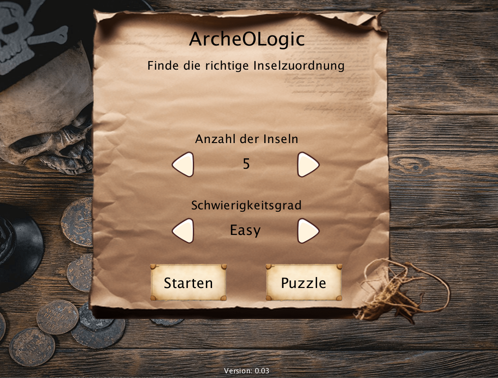
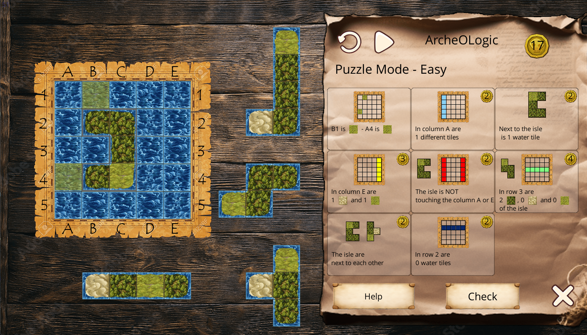
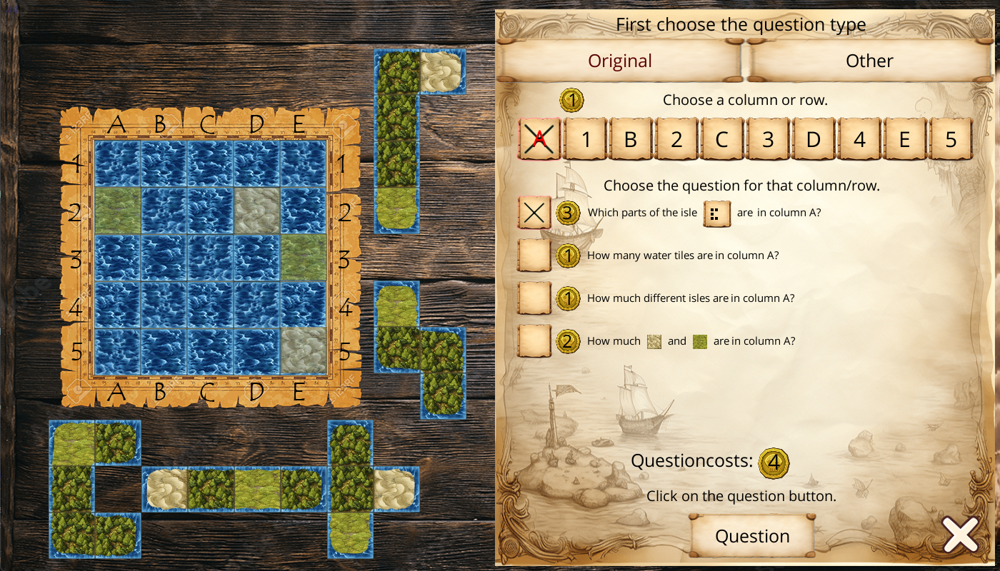

# ArcheOLogic

A digital adaptation of the deduction board game **ArcheOLogic**, expanded with a single-player solo mode and an infinite, uniquely-solvable puzzle mode — wrapped in a pirate-themed treasure hunt.

> Decipher the layout of the islands. Find your treasure. Trust only logic.



## The Game

You are a pirate trying to recover a buried treasure. The location is hidden inside a hidden island layout on a 5×5 grid. Six (or five, or seven) island shapes have to be placed exactly where the legend says they are — but the legend only speaks in clues:

- *In row 3 there are 2 water tiles.*
- *Next to the small island are 4 water tiles.*
- *The L-shaped island touches the corner.*
- *In column B there are 1 sand and 2 grass.*

Each clue eliminates layouts. Combine enough of them and only one valid configuration remains: the dig site.



## Modes

### Solo (Question) Mode
Same spirit as the original board game, but you play alone.
- Buy hints with coins. Cheaper clues first; the same hint type costs more next time.
- Solve as economically as possible — every coin spent counts against your score.
- A *Check* at the end either confirms your dig or costs you penalty points.

### Puzzle Mode
A pre-generated, **uniquely solvable** layout where all the hints you need are already on the table.
- Drag islands onto the grid; rotate by clicking; lay them out until the constraints all fit.
- Difficulty levels: **Newbie** · **Easy** · **Medium** · **Hard** — Newbie and Easy come with one or two islands already placed for free; Hard gives you nothing but the clues.
- Infinite levels: a fresh, valid puzzle is generated every time via Knuth's *Algorithm X*.

#### Newbie auto-help
In Newbie mode the game automatically marks any clue that no longer fits the current layout in red — every time you drop an island. **Free of charge.** A gentle teacher: shows you in real time which clue you just broke, without telling you the answer.



## Running

Requires JDK 17+.

```bash
# Desktop (LWJGL3)
./gradlew :desktop:run

# Browser (TeaVM, opens a local Jetty server on port 8080)
./gradlew :teavm:run

# Browser release artifact (build/dist/webapp/)
./gradlew :teavm:buildRelease

# Android debug APK
./gradlew :android:assembleDebug
```

## Languages

English and German. The interface auto-detects the OS or browser language at startup; a flag toggle in the menu lets you switch on the fly.

## Tech

- **libGDX 1.14.0** — desktop, Android and TeaVM web backend (`gdx-teavm 1.5.3`)
- Custom dirty-rendering layer (`Game.markDirty()` + on-demand render) — the canvas only redraws when input or state actually changes, so the browser stays idle when you do
- Pure Java 17, no GWT
- Knuth's Algorithm X for level generation

## Credits

- **Board game**: ArcheOLogic by Yves Tourigny
- **Code & this digital adaptation**: Dirk Aporius — [dirk.aporius@gmail.com](mailto:dirk.aporius@gmail.com)
